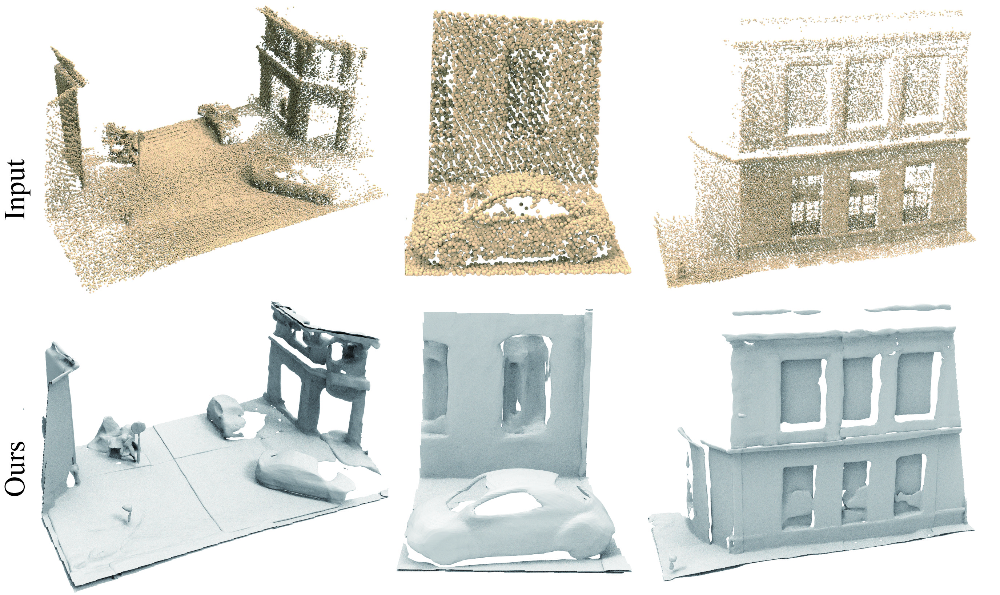
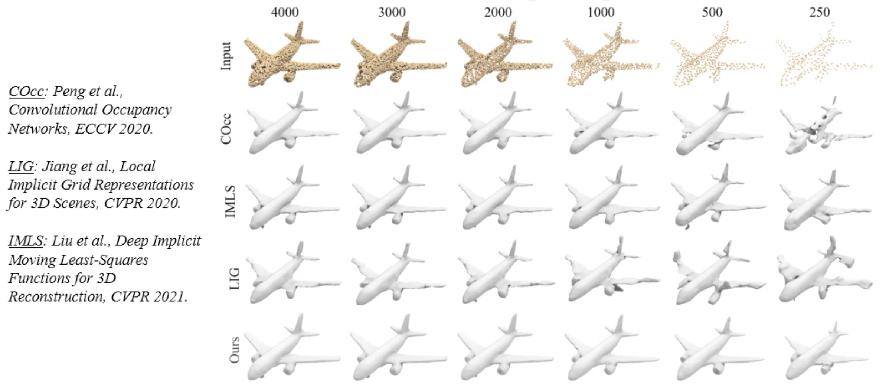
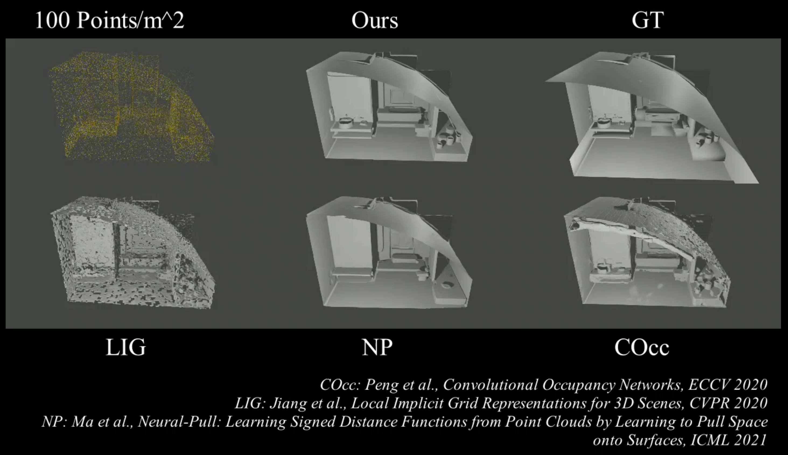

# Reconstructing Surfaces for Sparse Point Clouds with On-Surface Priors (CVPR 2022)

This repository contains the code to reproduce the results from the paper.
[Reconstructing Surfaces for Sparse Point Clouds with On-Surface Priors](https://yushen-liu.github.io/main/pdf/LiuYS_CVPR2022_OnSurfacePriors.pdf).

You can find detailed usage instructions for training your own models and using pretrained models below.

If you find our code or paper useful, please consider citing

    @inproceedings{On-SurfacePriors,
        title = {Reconstructing Surfaces for Sparse Point Clouds with On-Surface Priors},
        author = {Baorui, Ma and Yu-Shen, Liu and Zhizhong, Han},
        booktitle = {Proceedings of the IEEE/CVF Conference on Computer Vision and Pattern Recognition (CVPR)},
        year = {2022}
    }

## Surface Reconstruction Demo
<p align="left">
  
</p>

<p align="left">
  
</p>

<p align="left">
  
</p>

## Installation
First you have to make sure that you have all dependencies in place.
The simplest way to do so, is to use [anaconda](https://www.anaconda.com/). 

You can create an anaconda environment called `tf` using
```
conda env create -f tf.yaml
conda activate tf
```
## Training
You can train a new network from pre-train On-Surface Prior Networks, run

```
python onSurPrior.py --data_dir ./data/ --out_dir ./train_net/ --CUDA 0 --INPUT_NUM 500 --epoch 30000 --input_ply_file input.ply --train
```
You should put the point cloud file(--input_ply_file, only ply format) into the '--out_dir' folder, '--INPUT_NUM' is the number of points in the '--input_ply_file'.
## Test
You can extract the mesh model from the trained network, run
```
python onSurPrior.py --data_dir ./data/ --out_dir ./train_net/ --CUDA 0 --INPUT_NUM 500 --epoch 30000 --input_ply_file input.ply --test
```
